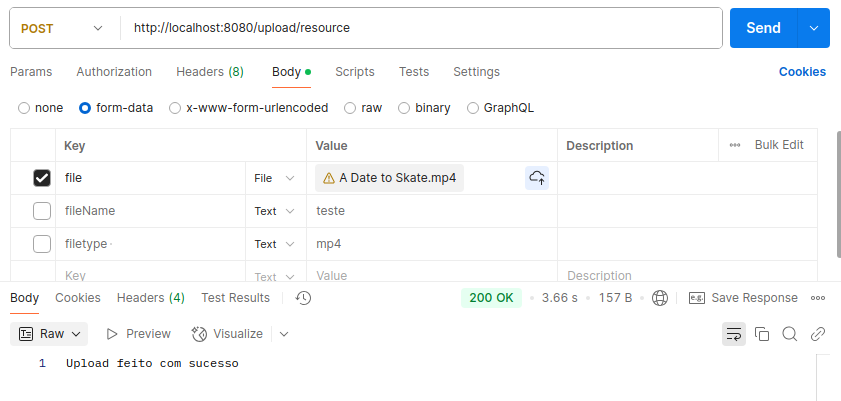

# Cloud
Project for Cloud System Administration 


# how to run 

+ git clone git@github.com:RS181/Cloud.git

+ cd ./Cloud/Rest_API_```XXXX```/jax-rs/jersey/jersey-jetty/

    + Substituir ```XXXX``` por a **Replica** ou **Servidor** dependendo qual queremos usar 

+ mvn clean package 

+ java -jar target/jersey-jetty.jar 


# Test in browser 

+ **Replica**
    
    + http://localhost:8080/hello/TESTE

+ **Servidor**
    + http://localhost:4040/hello/TESTE


# Location of Source files 

        (...)                               
            └── jax-rs
                ├── README.md
                └── jersey
                    ├── jersey-jetty
                    │   ├── README.md
                    │   ├── pom.xml
                    │   ├── src             ---> MAIN SOURCE FILE 
                    │   │   ├── main
                    │   │   │   └── java
                    │   │   │       └── com
                    │   │   │           └── mkyong
                    │   │   │               ├── MainApp.java
                    │   │   │               ├── MyResource.java
                    │   │   │               └── User.java
                    │   │   └── test
                    │   │       └── java
                    │   │           └── com
                    │   │               └── mkyong
                    │   │                   └── MyResourceTest.java
                    │   └── target

# Upload (Video & Files)

+ Example of ```File Upload``` (Similar in both API's, only changes the URL)




# Download (Vide & Files)

+ In this case we use a browser to test a mp4 download (because **POSTMAN** has limitations in HTTP body)

+   http://localhost:8080/download/resource/test.mp4


# TODO 


+ Implementar autenticacao baseada por API TOKEN (vamos utilizar isto para autenticar admin's, e estamos a supor que so admins sabem este token)


+ Configurar NGINX como 

    + Reverse proxy 
    + Https


+ Criar VM's apartir da API (pesquisar sobre isto)
    + tambem temos que desenvoler algo que nos crie uma vm perto da localizacao do cliente

+ Temos de arranjar forma de 'medir' a afluencia de trafego 

+ Reencaminhar trafego para outra replica 

# Duvidas 

+ Como e que medimos a afluencia de trafego? 
    + Na API ?
    + No NGINX ? 

+ Como e que modificamos codigo da API para incializar com ip correto?
    + No MainApp temos atributo ```BASE_URI```, e como modificamos esse atributo para colocar IP publico da cirada


+ Como vamos redirecionar o trafego? Fazemos isso na API com HTTP Redirect? 

